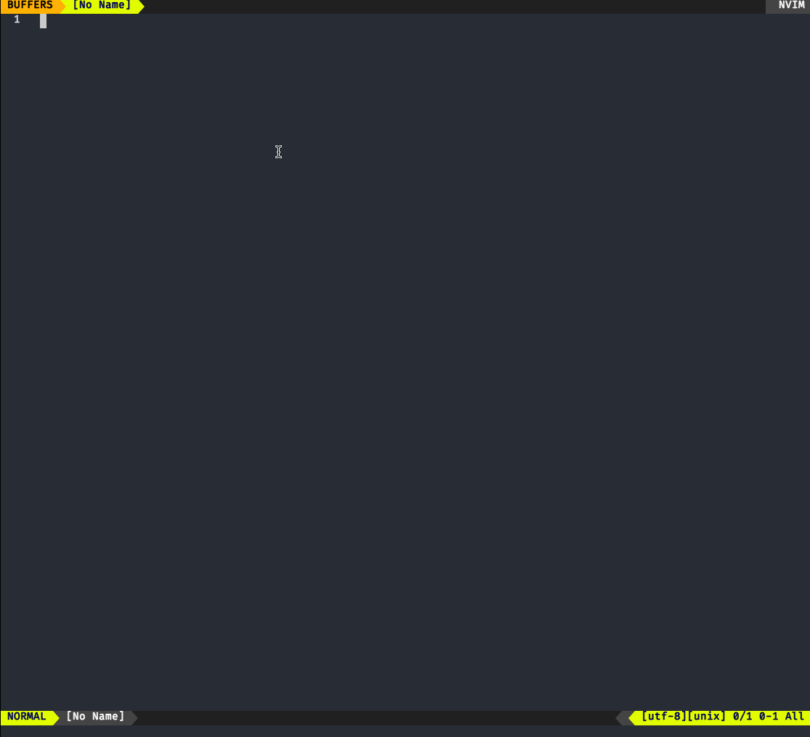

# fzf-switch-project

This plugin provides an easy way of switching between project directories
indexed from a specified workspace folder or folders. It's based on an idea I
originally stole from [kieran-bamforth](https://github.com/kieran-bamforth)'s
dotfiles.



## Install

#### Install via Plug

```vim
Plug 'benwainwright/fzf-project'
```

## Usage

Running `FzfSwitchProject` in command mode will produce a list of folders from
within your workspace folders. When you select a project, the working directory
is changed and you are presented with a fzf list of files to switch to.

## AutoRooting

Installing `FzfSwitchProject` will automatically `cd` to the root directory of
any given project when you open a file. It does this by recursively locating the
nearest `.git` folder in the directory hierarchy. For this reason, is
recommended to use `git` with this plugin

## Git Initialisation

To assist with the above, if you switch to a folder that does not contain a
`.git` repository, you have the option of automatically creating one. This
behavior can be configured below.

## Configure

```vim
let g:fzfSwitchProjectWorkspaces = [ '~/workspace1', '~/workspace2' ]
```

automatically list projects in the above folders

```vim
let g:fzfSwitchProjectProjects = [ '~/folder1', '~/folder2' ]
```

add individual folders to the project list (I use it for my
dotfiles folder)

```vim
let g:fzfSwitchProjectGitInitBehavior = 'ask' " default
```

what to do if you switch to a project folder that doesn't contain a `.git`
directory:

- `ask` (default) prompt the user to confirm if a new git repository should be
  initialised
- `auto` always initialise a new git repository if one isn't found
- `none` do nothing

Command that is executed to get a list of all the files in a given project

```vim
let g:fzfSwitchProjectFindFilesCommand = 'git ls-files --others --exclude-standard --cached' " default
```

Don't automatically open a file picker once project is selected

```vim
let g:fzfSwitchProjectAlwaysChooseFile = 0
```

## Commands

- `FzfSwitchProject` - open project switcher
- `FzfChooseProjectFile` - switch file within project

## Dependencies

- [fzf.vim](https://github.com/junegunn/fzf.vim)
- [fugitive](https://github.com/tpope/vim-fugitive)
